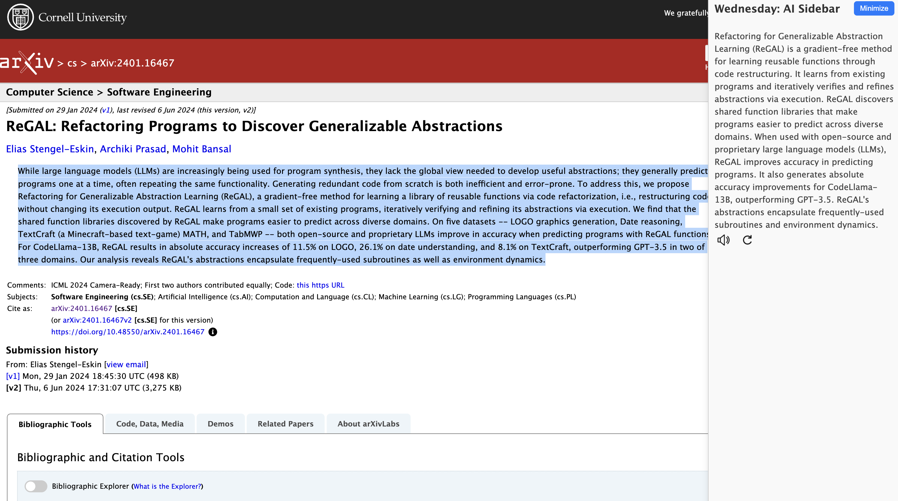

# Wednesday


**Wednesday** is a Chrome extension that automatically summarizes web page content using AI. It provides an AI-powered sidebar that enhances your browsing experience by summarizing selected text and fetching relevant links from social media and search engines.

## Features

- **AI-Powered Summaries**: Get concise AI-generated summaries of selected content.
- **Related Links**: View and access related links from Reddit and search engines.
- **Text-to-Speech**: Listen to the summaries using text-to-speech functionality.



## Requirements 
To try it out, you need to:

- be on Mac or Windows
- be on Chrome dev / canary (version >= 127)
- enable chrome://flags/#optimization-guide-on-device-model (set to Enabled BypassPerfRequirement)
- enable chrome://flags/#prompt-api-for-gemini-nano (set to Enabled)
- if this fails, try chrome://components and look for On Device Model
    this should have a version which is not 0.0.0.0 -- you can bang on the update button if you'd like (don't bang too hard)
    eventually this will have the right value (after downloading the model), then you'll need to relaunch chrome and try again

## Installation

1. Clone the repository:
   ```sh
   git clone https://github.com/deepak-jha-kgp/wednesday.git
2. Open Chrome and go to chrome://extensions/.
3. Enable “Developer mode” by toggling the switch in the top-right corner.
4. Click on “Load unpacked” and select the directory where you cloned the repository.

## Usage
1. Select any text on a web page.
2. The sidebar will automatically summarize the selected text and fetch relevant links.
3. Use the text-to-speech buttons to listen to the summary.

### TODO

- Add global settings for speech and voice.
- Maintain global state for minimizing.
- Add better SERP (Search Engine Results Page) APIs.
- Summarize if selected text resembles news.
- Add Arxiv and Wikipedia search results.

## License
This project is licensed under the MIT License. See the LICENSE file for more details.

## Contact
For any queries or issues, please open an issue on GitHub.